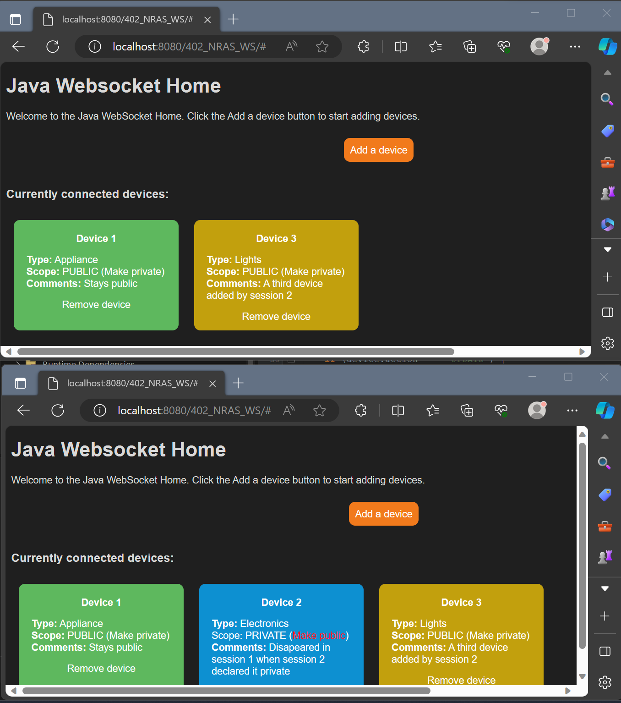

# Java WebSocket Example for Apache Tomcat

This contribution may be useful for any one who likes tho implement a simple WebSocket Server/Client for the use with Apache Tomcat for education purposes or further development.

Implements server/client communication over the WebSocket protocol for the integration into the Apache Tomcat Web Application Framework. The following features are demonstrated (full-duplex,bidirectional):
- Message created in one session seen on all other sessions
- Message removal on all sessions
- Message added and removed for specific sessions

This is an adaption from the Oracle tutorial with the following modifications:
- Edited for deployment on Apache Tomcat instead of Glassfish
- Generalized message model
- Message propagation for specific session

Reference:
Java EE 7: Building Web Applications with WebSocket, JavaScript and HTML5 
https://www.oracle.com/webfolder/technetwork/tutorials/obe/java/HomeWebsocket/WebsocketHome.html

The source code includes
- HTML, JS, CSS for the rendering and handling of the messages on the client side (browser)
- Server side implementation for the WebSocket call backs
- Session management and message handling triggered by the call backs

Printscreen of two browsers (sessions) seeing the same messages simultaneously, and one message seen only on the session which declared it private.

Set up the project in your environment:
1. Install Apache Tomcat
2. Add a new Java Web Jakarta EE 11 project in your IDE
3. Change the context path /402_NRAS_WS suitable for your environment/project
4. Pull or donwload the files from this repository
5. Change the context path in the websocket.js WebSocket initialization call
6. Dowload the declared dependencies (see pom.xml), JSON jar must be downloaded manually in some cases 

Niklaus Aeschbacher (com.nras.*)
